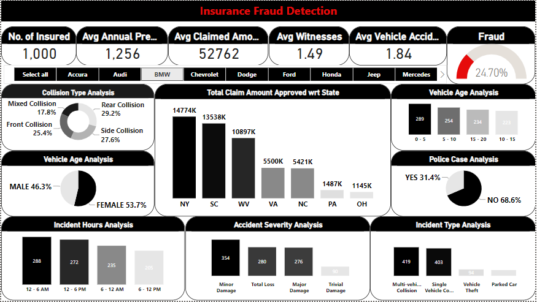

# Insurance Fraud Detection Analysis

## Introduction

This repository contains an in-depth analysis and interpretation of insurance fraud detection based on a comprehensive dataset. The primary objective is to gain insights into fraudulent activities within insurance claims and propose strategies for fraud prevention.

## Key Findings

- **Dataset Overview**: The dataset consists of 1000 insurance claims, with an average annual premium of $1254 and an average claimed amount of $56388. Approximately 24.70% of the claims are suspected to involve fraudulent activity.
- **Demographic Insights**: Females filed 54% of the claims, while males accounted for 46%. Accidents often involved witnesses, with an average of 2 cars per incident.

## Interpretation and Suggestions

### State-wise Analysis

- **Variations in Claims**: Significant differences in total claim amounts are observed across states, with New York and South Carolina leading.
- **Fraud Rates by State**: States like Ohio and North Carolina exhibit notably high fraud rates, influencing total claim amounts.
- **Recommendations**: Implement targeted monitoring and verification measures, especially in states with higher fraud rates.

### Accident Severity and Collision Type Analysis

- **Claim Rates for Major Accidents**: Major accidents show high claim rates, surpassing 60.00%.
- **Fraud Rates by Collision Type**: Both multi-vehicle and single-vehicle collisions have fraud claim rates exceeding 25.0%.
- **Recommendations**: Conduct manual reviews for claims involving major accidents and specific collision types to mitigate fraudulent claims.

### Time Analysis

- **Temporal Variations in Fraud Rates**: Fraud rates vary with time, with higher rates observed during specific hours.
- **Recommendations**: Heightened vigilance and additional verification measures during peak fraud hours.

### Vehicle Age Analysis

- **Fraud Rates by Vehicle Age**: Fraud rates vary with the age of vehicles, with relatively higher rates for vehicles aged 0 to 10 years.
- **Recommendations**: Implement targeted monitoring and verification measures for vehicles within the 0 to 10 years range.

### Pattern and Trends

- **High-risk Combinations**: Specific combinations of factors, such as Ford vehicles, police cases, major accident severity, and young vehicle age, result in alarmingly high fraud rates.
- **Recommendations**: Implement targeted investigations and enhanced scrutiny for high-risk combinations.

## Conclusion

The analysis underscores the importance of implementing targeted monitoring, verification measures, and manual reviews to effectively mitigate fraudulent activities within insurance claims.
